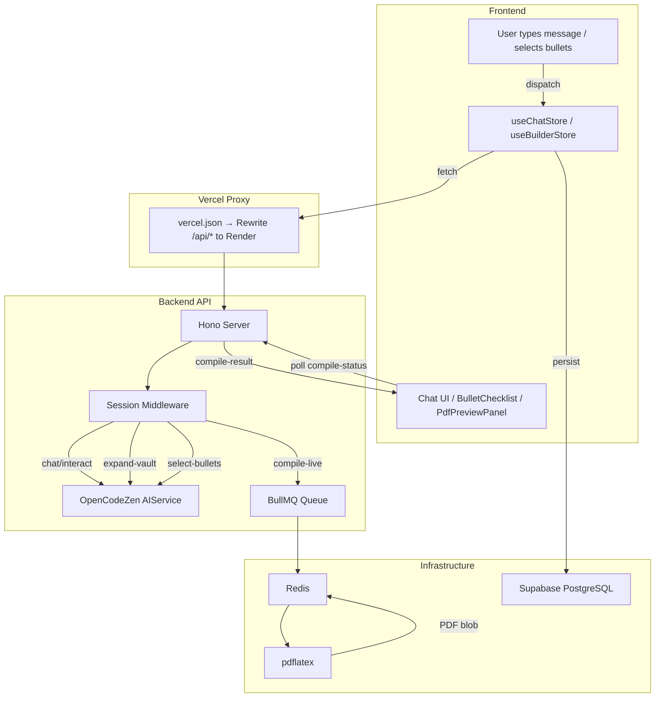

# Resumint

> **Resumes that get interviews** — AI-powered resume tailoring for NSUT students.

A chat-driven career vault and split-screen live LaTeX builder. Students converse with an AI assistant to build an exhaustive "Career Vault" of experiences, projects, and skills, then tailor bullet-point selections to any job description and see the compiled PDF update in real time.

---

## Architecture

```
User Browser
    │
    ├── Vercel (Next.js 16 — Frontend + Auth)
    │       │
    │       ├── App Layout (Sidebar desktop + MobileNav drawer)
    │       ├── Auth (Better Auth — Google OAuth, domain restriction)
    │       ├── Career Vault & Split-Screen Tailoring Builder
    │       ├── Zustand Global State (useChatStore, useBuilderStore, useProfileStore)
    │       └── Tailwind v4 + Phosphor Icons + Custom UI Kit
    │
    ├── Render (Express + Hono — Backend API)
    │       ├── /api/protected/*  (all authenticated routes)
    │       ├── /api/health       (unauthenticated)
    │       ├── OpenCodeZen AI    (intent parsing, vault expansion, bullet selection)
    │       ├── BullMQ + Redis    (async PDF compilation queue)
    │       └── pdflatex          (server-side LaTeX → PDF)
    │
    ├── Supabase PostgreSQL (via Prisma v7 ORM)
    ├── Redis                 (BullMQ job broker + PDF blob cache)
    └── GitHub API            (repo import for project details)
```

**Request flow:** Vercel proxies `/api/*` (excluding `/api/auth/*`) to Render via `vercel.json` rewrites using experimental services. Auth is handled on Vercel to keep session cookies on the same domain. The backend middleware intercepts `/api/protected/*` and enforces the BetterAuth session.

---

## Tech Stack

| Layer | Technology |
|-------|-----------|
| **Frontend** | Next.js 16.2 (App Router, Turbopack), React 19, TypeScript |
| **Backend** | Express + Hono + tsx on Render |
| **Auth** | Better Auth v1.6 (Google OAuth, `@nsut.ac.in` domain restriction) |
| **Database** | Supabase PostgreSQL via Prisma v7 |
| **AI** | OpenCode Zen (`deepseek-v4-flash-free`) — intent parsing, vault generation, bullet selection |
| **PDF** | LaTeX compilation (pdflatex) on Render via BullMQ + Redis |
| **Styling** | Tailwind CSS v4 (dark theme, glassmorphism, custom design tokens) |
| **Fonts** | Cabinet Grotesk (headings), Satoshi (body), JetBrains Mono (code) |
| **State** | Zustand — `useChatStore`, `useBuilderStore`, `useProfileStore` |
| **Icons** | `@phosphor-icons/react` |
| **Infrastructure** | Vercel (frontend) + Render (backend + Postgres + Redis) |
| **Package Manager** | npm workspaces (monorepo: `frontend/`, `backend/`, `packages/shared/`) |

---

## Screens & UX Flow

### 1. Landing Page (`/`)

A sleek dark-theme (`--bg: #09090b`) guest page with a glowing green radial orb, premium typography, and interactive glassmorphic cards.

- **Header:** "ResumeMint" with an animated green gradient badge
- **Slogan:** "Resumes that get interviews"
- **CTA:** Google OAuth sign-in button (`SignInButton`)
- **Navigation Cards:** Dashboard, Career Vault, Tailor Workspace
- **Badges:** Live ATS scoring, Per-job tailoring, Smart version tracking

### 2. Conversational Onboarding (`/onboarding`)

A focused glass card interface (`ChatContainer`) that replaces the legacy multi-step wizard.

- AI assistant greets the user and guides vault creation conversationally
- **Upload Dropzone** (`ResumeUploadWidget`) — drag-and-drop existing PDF import
- **Vault Extraction** — backend parses PDFs or expands conversational input into structured data (education, experience, projects, skills)
- **Accept/Review** — AI displays extracted widgets for user review
- On completion, saves profile to PostgreSQL and redirects to `/dashboard`

### 3. Student Dashboard (`/dashboard`)

Full-screen dashboard with sidebar navigation (`nav.tsx`) and mobile drawer (`mobile-nav.tsx`).

- **Welcome Card** — Personalized greeting
- **Vault Stats Grid** — Counts of education entries, experiences, projects, skills
- **Profile Completeness Gauge** — Circular progress indicator
- **ATS Widget** — Visual gauge of average ATS rating (default ~82%)
- **Quick Actions** — "Tailor a new Resume" or "Edit Career Vault"

### 4. Split-Screen Tailor Workspace (`/tailor`)

A professional **35/65 split-screen** with a draggable resizer (`Splitter.tsx`). Panel widths persist in `localStorage`.

- **Left Panel (`GenerateChatWorkspace`):**
  1. Job Details Form — Company, Job Title, Job Description
  2. Bullet Checklist — AI matches vault bullets against the JD; user picks which to include
  3. Contact/Education/Experience/Skills selection widgets
- **Right Panel (`PdfPreviewPanel`):**
  - Live LaTeX PDF preview that recompiles on any selection change (800ms debounce)
  - Calls `POST /api/protected/resume/compile-live`
  - Loading spinner during compilation

---

## Core Features

- **Chat-Driven Vault Building** — Conversational AI to construct an exhaustive career vault without manual forms
- **Dynamic Vault Expansion** — Brief project/experience descriptions → 10–12 comprehensive bullet points via AI
- **JD-Aware Bullet Selection** — AI matches vault bullets to a job description and recommends the 3–4 best ones
- **Live PDF Compilation** — Server-side LaTeX via pdflatex, enqueued through BullMQ + Redis, returns raw PDF blobs
- **ATS-Optimized Output** — LaTeX templates engineered for clean text extraction and ATS parser compatibility
- **Domain-Restricted Auth** — Only `@nsut.ac.in` Google accounts can sign up
- **Resume History & Versioning** — Track and revert to previous tailored versions

---

## Data Flow: End-to-End



**Detailed Walkthrough:**

1. **User Input** — The user types a message in the chat interface or toggles a bullet checkbox. Zustand stores (`useChatStore` / `useBuilderStore`) dispatch side-effect calls to the backend.

2. **API Routing** — Requests go through the Vercel proxy (`/api/*`) to the Hono server. The session middleware on `/api/protected/*` verifies the BetterAuth cookie.

3. **AI Processing** — Depending on the intent:
   - `POST /api/protected/chat/interact` — Parses the user's message, determines the phase (upload, review, expand, complete), and returns reply + widget type
   - `POST /api/protected/ai/expand-vault` — Expands brief descriptions into exhaustive bullet lists
   - `POST /api/protected/ai/select-bullets` — Matches vault bullets against a JD and ranks them

4. **PDF Compilation** — When the user updates selections:
   - `POST /api/protected/resume/compile-live` receives selected bullet IDs, filters the vault, generates a `.tex` file with the `LatexTemplateFiller`, and enqueues a BullMQ job
   - The PDF worker runs `pdflatex` inside the Render Docker container (texlive-latex-base installed)
   - The resulting PDF blob is stored in Redis; the frontend polls `compile-status/:jobId` and then fetches `compile-result/:jobId`

5. **Persistence** — Profile data (vault, tailored resumes) is persisted to Supabase PostgreSQL via Prisma 7.

---

## Project Structure

```
resumemint/
├── frontend/                    # Next.js 16 App Router
│   └── src/
│       ├── app/                 # Pages (/, /onboarding, /dashboard, /tailor)
│       │   ├── globals.css      # Design tokens, Tailwind v4, animations
│       │   ├── layout.tsx       # Root layout (fonts, ThemeProvider, Toaster)
│       │   ├── page.tsx         # Landing page
│       │   ├── onboarding/      # Conversational onboarding
│       │   ├── dashboard/       # Student dashboard + settings + analytics
│       │   └── tailor/          # Split-screen tailoring workspace
│       ├── components/          # UI component library
│       │   ├── ui/              # Base primitives (Button, Card, Input, Badge, Splitter…)
│       │   ├── chat/            # Chat container, bubbles, input, widgets
│       │   ├── generate/        # Builder workspace panels, checklists, PDF preview
│       │   └── layout/          # AppLayout, Sidebar, MobileNav
│       └── store/               # Zustand stores
│           ├── chatStore.ts     # Messages, onboarding phase, AI interaction flags
│           ├── builderStore.ts  # Split-screen state, bullet selection, compile triggers
│           └── profileStore.ts  # Profile CRUD (vault operations)
├── backend/                     # Express + Hono API
│   └── src/
│       ├── index.ts             # Server entry, CORS, middleware, route mounting
│       ├── config/              # BetterAuth, Prisma client
│       ├── interface/routes/    # Route handlers (chat, ai, resume, profile, history)
│       ├── core/                # Use cases, domain entities, DTOs
│       ├── infrastructure/      # AI service, PDF parser, LaTeX filler, queues, prompts
│       ├── di/container.ts      # Dependency injection wiring
│       └── shared/              # Zod schemas, TypeScript domain types
├── packages/shared/             # Shared types & Zod schemas
├── docker-compose.yml           # Local Redis (only service needing Docker)
├── vercel.json                  # Vercel experimental services config
├── render.yaml                  # Render deployment blueprint
└── .env.example                 # Required environment variables
```

---

## State Management (Zustand)

| Store | Purpose | Key State |
|-------|---------|-----------|
| `useChatStore` | Conversational AI interaction | `messagesByMode`, `currentPhase`, `isTyping`, `mode`, `extractedData` |
| `useBuilderStore` | Split-screen tailoring builder | `profile`, `jobTitle`, `jobDescription`, `selectedBulletIds`, `isCompiling`, `pdfUrl` |
| `useProfileStore` | Career vault CRUD | Profile fields, `addProject`, `addExperience`, `addEducation`, `saveProfile` |

---

## API Routes

All authenticated routes live under `/api/protected/*`:

| Route | Description |
|-------|-------------|
| `POST /api/protected/chat/interact` | Intent parsing & reply generation |
| `POST /api/protected/chat/save` | Persist chat message |
| `GET /api/protected/chat/history` | Fetch chat history by mode |
| `DELETE /api/protected/chat/clear` | Clear chat history |
| `POST /api/protected/ai/generate-bullets` | Generate bullets per section |
| `POST /api/protected/ai/expand-vault` | Expand brief → 10-12 bullets |
| `POST /api/protected/ai/select-bullets` | Match vault to JD |
| `POST /api/protected/resume/tailor` | Tailor resume to job |
| `POST /api/protected/resume/parse` | Parse uploaded PDF |
| `POST /api/protected/resume/compile-live` | Compile PDF (live preview) |
| `GET /api/protected/resume/compile-status/:jobId` | Poll compilation status |
| `GET /api/protected/resume/compile-result/:jobId` | Fetch compiled PDF |
| `POST /api/protected/profile/*` | Profile CRUD |
| `POST /api/protected/history/*` | Resume history CRUD |
| `GET /api/health` | Health check (unauthenticated) |

---

## Environment Variables

See `.env.example` for all required variables. Key groups:

- **Database:** `DATABASE_URL` (Supabase PostgreSQL)
- **Auth:** `BETTER_AUTH_URL`, `GOOGLE_CLIENT_ID`, `GOOGLE_CLIENT_SECRET`
- **AI:** `OPENCODEZEN_API_KEY`
- **Redis:** `REDIS_URL` (Render internal or Upstash)
- **Vercel:** `VERCEL_FRONTEND_URL` (for CORS origin)

---

## Local Development

```bash
# 1. Start Redis (only service needing Docker)
docker-compose up -d redis

# 2. Install all dependencies
npm install

# 3. Generate Prisma client
npm run db:generate

# 4. Run backend (Express + Hono on port 8080)
npm run dev:backend

# 5. In another terminal — run frontend (Next.js on port 3000)
npm run dev:frontend
```

Visit `http://localhost:3000` and sign in with an `@nsut.ac.in` Google account.

---

## Deployment

- **Frontend:** Deployed to Vercel via `vercel.json` (experimental services with monorepo support)
- **Backend:** Docker container on Render (Express + Hono + BullMQ worker + pdflatex)
- **Database:** Supabase PostgreSQL, connected via Prisma 7
- **Redis:** Render internal Redis or Upstash (BullMQ job broker + PDF blob cache)

---

## Design System

- **Theme:** Dark-only, premium glassmorphism
- **Colors:** Custom CSS variables (`--bg: #09090b`, `--accent: #16a34a`, green brand)
- **Typography:** Cabinet Grotesk (display), Satoshi (body), JetBrains Mono (code)
- **Components:** Custom UI kit in `src/components/ui/` — no external libraries like shadcn/ui
- **Icons:** `@phosphor-icons/react` — not lucide-react
- **Animations:** `fade-up`, `float`, `pulse-glow`, `ats-grow`, `bounce-dot`, `shimmer`
- **Effects:** `.glass` (backdrop-blur), `.card-lift` (hover lift), `.btn-glow`, `.gradient-text`

---

## License

Proprietary — NSUT student project.
