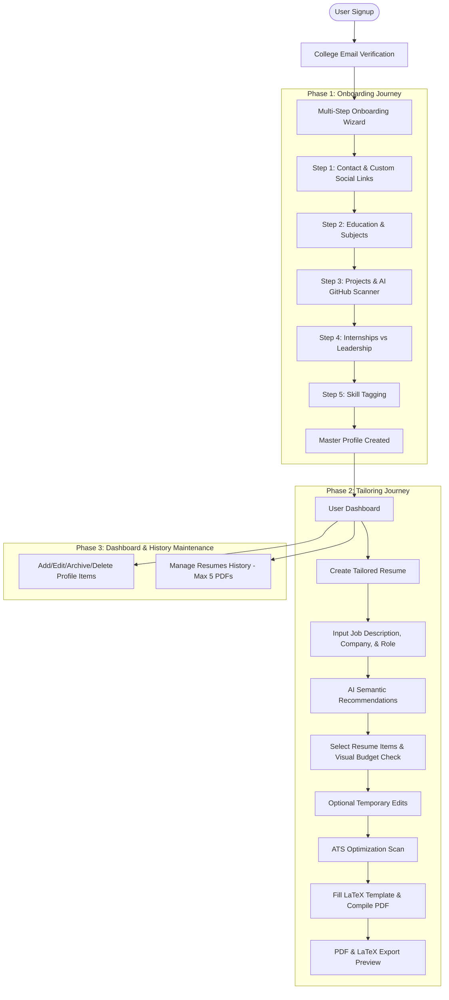

# ResumeMint Functional Behavior & User Workflow

This document details the complete step-by-step functional and behavioral workflow of ResumeMint. It defines user interactions, AI-driven automation, page budgets, and database specifications based on college-approved recruitment guidelines (e.g., NSUT standard).

---

## 1. System Architecture & Workflow Overview



---

## 2. Phase 1: User Authentication & Onboarding Journey

### 2.1 Authentication & College Email Verification
1. **Initial Access**: The user signs up using a standard email provider (e.g., Google OAuth, personal Gmail, Github login).
2. **Account Restriction**: After creation, the profile is flagged as `inactive_unverified`.
3. **Verification Screen**: A verification page forces the user to input their official college email (e.g., `student@nsut.ac.in`).
   * *Regex Validation*: `^[a-zA-Z0-9._%+-]+@nsut\.ac\.in$`
   * *Constraint*: The system sends an OTP or verification link. The wizard is inaccessible until this specific address is verified. This prevents students from creating multiple draft profiles or consuming excessive AI resources on temporary accounts.

### 2.2 Relational Database Schema (Master Profile & Custom links)
The database stores data using a relational schema (represented here as SQL/Prisma models) to maintain profile integrity:

```prisma
model User {
  id               String         @id @default(uuid())
  email            String         @unique // Signup email
  collegeEmail     String         @unique // Verified official email
  isEmailVerified  Boolean        @default(false)
  createdAt        DateTime       @default(now())
  profile          MasterProfile?
  resumes          Resume[]
}

model MasterProfile {
  id                String                     @id @default(uuid())
  userId            String                     @unique
  user              User                       @relation(fields: [userId], references: [id], onDelete: Cascade)
  fullName          String
  phoneNumber       String
  altEmail          String?
  linkedinUrl       String
  githubUrl         String
  leetcodeUrl       String?
  codolioUrl        String?
  portfolioUrl      String?
  customLinks       CustomLink[]
  education         Education[]
  projects          Project[]
  workExperiences   WorkExperience[]
  positionsOfResp   PositionOfResponsibility[]
  skills            Skill[]
  certifications    Certification[]
}

model CustomLink {
  id              String        @id @default(uuid())
  profileId       String
  profile         MasterProfile @relation(fields: [profileId], references: [id], onDelete: Cascade)
  label           String        // e.g., "Behance", "Devpost"
  url             String
}

model Education {
  id              String        @id @default(uuid())
  profileId       String
  profile         MasterProfile @relation(fields: [profileId], references: [id], onDelete: Cascade)
  institutionName String
  degreeBranch    String        // e.g., "B.Tech - Computer Science"
  passingYear     Int
  scoreType       String        // "CGPA" or "Percentage"
  score           Float         // e.g., 8.29 or 91.80
  subjects        String[]      // e.g., ["DBMS", "OS", "Algorithms"]
}

model Project {
  id              String        @id @default(uuid())
  profileId       String
  profile         MasterProfile @relation(fields: [profileId], references: [id], onDelete: Cascade)
  title           String
  githubUrl       String?
  duration        String        // e.g., "Dec 2024 - Jan 2025"
  techStack       String[]      // e.g., ["React", "Firebase"]
  rawSummary      String        // User's pasted/written description
  bullets         ProjectBullet[]
  isArchived      Boolean       @default(false)
}

model ProjectBullet {
  id              String        @id @default(uuid())
  projectId       String
  project         Project       @relation(fields: [projectId], references: [id], onDelete: Cascade)
  content         String        // AI generated bullet text
}

model WorkExperience {
  id              String        @id @default(uuid())
  profileId       String
  profile         MasterProfile @relation(fields: [profileId], references: [id], onDelete: Cascade)
  companyName     String
  roleTitle       String
  duration        String
  experienceType  String        // "Tech" or "Non-Tech"
  rawSummary      String        // User's pasted/written description of work
  bullets         ExperienceBullet[]
  isArchived      Boolean       @default(false)
}

model ExperienceBullet {
  id              String        @id @default(uuid())
  experienceId    String
  experience      WorkExperience @relation(fields: [experienceId], references: [id], onDelete: Cascade)
  content         String        // AI generated bullet text
}

model PositionOfResponsibility {
  id               String        @id @default(uuid())
  profileId        String
  profile          MasterProfile @relation(fields: [profileId], references: [id], onDelete: Cascade)
  organizationName String
  roleTitle        String
  duration         String
  rawSummary       String        // User's pasted description of responsibilities
  bullets          ResponsibilityBullet[]
  isArchived       Boolean       @default(false)
}

model ResponsibilityBullet {
  id               String        @id @default(uuid())
  responsibilityId String
  responsibility   PositionOfResponsibility @relation(fields: [responsibilityId], references: [id], onDelete: Cascade)
  content          String        // AI generated bullet text
}

model Certification {
  id              String        @id @default(uuid())
  profileId       String
  profile         MasterProfile @relation(fields: [profileId], references: [id], onDelete: Cascade)
  name            String
  issuingOrg      String
  duration        String
  certificateUrl  String?
  rawSummary      String        // User's description of what they learned/did
  bullets         CertificationBullet[]
  isArchived      Boolean       @default(false)
}

model CertificationBullet {
  id              String        @id @default(uuid())
  certificationId String
  certification   Certification @relation(fields: [certificationId], references: [id], onDelete: Cascade)
  content         String        // AI generated bullet text
}
```

### 2.3 Onboarding Steps Detail

#### Step 1: Contact Info & Custom Links
* Pre-filled `@nsut.ac.in` email from the verified session (read-only).
* Dynamic custom link field:
  * Click `"Add Social Link"` button -> Appends an item row containing `Label` text input and `URL` text input.
  * *UI Validation*: Checks URLs using standard format regex: `^(https?:\/\/)?([\da-z\.-]+)\.([a-z\.]{2,6})([\/\w \.-]*)*\/?$`

#### Step 2: Education
* Form fields: Institution, Degree/Branch, Year, Score Type (Dropdown: CGPA, Percentage), Score value.
* **Subjects studied tagging**: A chip-input area allowing the user to select core subjects studied (e.g., Database Management Systems, Operating Systems, Computer Networks).

#### Step 3: Projects & AI GitHub Scanning (Unified Checkpoint Flow)
* **GitHub Repository Analysis**:
  * User inputs the Project Title and a public GitHub Repository URL.
  * The interface alerts the user to ensure the URL is public.
  * **AI Scanner UI**: A progressive, mock status log simulates real-time activity:
    1. `[+] Fetching repository structure...`
    2. `[+] Analyzing package.json / file tree...`
    3. `[+] Identifying tech stack and core modules...`
    4. `[+] Generating bullet points...`
  * **Bullet Point Selection & Inline Editing**:
    * The AI returns **15 to 20 descriptive bullet points** highlighting features, technical challenges, and achievements.
    * Users select points using checkboxes.
    * Users can **edit any bullet point inline** at any time—either before checking it or after it has been added to their selection.
    * **Only selected/checked points** are saved to the database.
* **Manual Bypass Option**: If the user does not have a GitHub repository link (or it is private), they check a box to manually input the Project Name, Tech Stack, and a raw detailed project description (minimum 100 characters). 
  * The AI analyzes this raw description, generates **15-20 professional bullet points**, presents them as a checkbox checklist, and the user selects the ones to save.
* **Project Limit**: There is no maximum limit. Users can save as many projects to their Master Profile database as they wish.

#### Step 4: Internships, Leadership, and Certifications (Unified AI Reformatting Checkpoint Flow)
* To create a high-quality resume, students are **never** asked to write bullet points directly. Instead, they enter raw details, and the AI reformats them into professional, ATS-friendly bullet points, presenting a checklist for selection.
* **Internships / Work Experience**:
  * User inputs: Company Name, Role/Title, Duration, and a raw description of their responsibilities/tasks.
  * The AI analyzes the details, generates **10 to 15 bullet points**, and displays them as checkboxes.
  * User reviews, edits inline, and selects points to save to the database.
* **Positions of Responsibility**:
  * User inputs: Organization Name, Role/Title, Duration, and a raw description of their activities/contributions.
  * The AI analyzes the details, generates **10 to 15 bullet points**, and displays them as checkboxes.
  * User reviews, edits inline, and selects points to save to the database.
* **AI Course & Certification Enhancer**:
  * User inputs: Course/Certification Name, Issuing Org, Certificate URL (optional), and a raw description of their key learnings, assignments, or projects built during the course.
  * The AI processes the details, generates **5 to 10 ATS-friendly bullet points**, and presents them as checkboxes.
  * User reviews, selects, and saves to the database.
* **Database Constraint**: For all experience types (Projects, Work, Leadership, Certifications), the raw description is kept as item metadata, but only the checked bullet points are saved as active resume content items in the database.

#### Step 5: Skill Input
* Three distinct tag-pill inputs:
  1. Technical/Programming Skills (e.g., C++, React, Docker)
  2. Non-Technical/Soft Skills (e.g., Public Speaking, Team Coordination)
  3. Core Engineering Concepts (e.g., DBMS, OOPs, Computer Networks)
* No proficiency rating is allowed to maintain clean college styling.


---

## 3. Phase 2: The Tailoring Journey

### 3.1 AI Semantic Matching & Recommendations
When a user pastes a target Job Description (JD), the app triggers the recommendation algorithm:

```json
// POST /api/recommend-items
// Request Payload:
{
  "jobDescription": "Looking for a Software Engineer Intern with experience in React, Node.js, and MongoDB. Familiarity with cloud deployments like AWS and relational databases is a plus.",
  "role": "Software Engineer Intern",
  "company": "Atlassian"
}
```
* **Keyword Matching & Semantic Relevance**:
  1. The AI extracts target entities (keywords: `React`, `Node.js`, `MongoDB`, `AWS`, `relational databases`).
  2. It performs vector-embedding similarity or substring matching against the user's projects, experiences, and skills database.
  3. Returns a matching map.
* **Response Payload**:
```json
{
  "recommendedProjectIds": ["proj-123-react-app", "proj-789-node-backend"],
  "recommendedExperienceIds": ["exp-456-swe-intern"],
  "recommendedSkillIds": ["skill-react", "skill-nodejs", "skill-mongodb", "skill-sql"],
  "keywordMatches": ["React", "Node.js", "MongoDB"]
}
```
* **UI Behavior**: Pre-selects matching checkboxes and adds a green `[Recommended]` pill next to the items. All other database elements remain visible but unchecked.

### 3.2 Scoped Changes & Profile Read-Only Integrity
* Any edit done on bullet points during resume tailoring is saved to the specific `ResumeVersion` document, **not** to the `MasterProfile` database.
* The backend enforces this by copying the items to a dedicated compilation payload:
```json
// POST /api/compile-resume
{
  "resumeName": "Atlassian Apply",
  "personalDetails": { ... },
  "selectedProjects": [
    {
      "id": "proj-123-react-app",
      "title": "React Dashboard",
      "bullets": [
        "Architected responsive dashboard... (User edited text here)"
      ]
    }
  ]
}
```

### 3.3 The One-Page Enforcer: Line Space Algorithm
To ensure the resume compiled fits onto exactly one page, the editor executes a dynamic space check.

#### Space Budget Constants:
* Total lines budget on a standard single-page resume with standard fonts: **56 lines**.
* Layout Overhead (Header, Contact, Title): **8 lines**.
* Section Headers (Education, Projects, Experience, Skills): **2 lines each** (Total: **8 lines**).

#### Element Line Values:
* **Education**: 3 lines per institution.
* **Project**: 1 line (Title + Tech stack) + 1 line per bullet point (wrapped text > 80 chars counts as 2 lines).
* **Experience**: 1 line (Company + Role + Date) + 1 line per bullet point.
* **Skills**: 1 line per 8 tag pills.

#### Calculation Formula:
$$\text{Total Lines} = \text{Overhead} + (\text{Sections} \times 2) + \sum \text{Lines}_{\text{Education}} + \sum \text{Lines}_{\text{Projects}} + \sum \text{Lines}_{\text{Experience}} + \sum \text{Lines}_{\text{Skills}}$$

* **Visual Feedback**:
  * Under 50 lines: Green Bar (`Safe: X% full`).
  * 51 - 56 lines: Orange Bar (`Optimal: X% full`).
  * \> 56 lines: Red Warning (`Overflowing: X lines will spill onto Page 2`). The "Compile PDF" button displays a warning prompt.

---

## 4. Phase 3: Dashboard & History Maintenance

### 4.1 Storage & History Limit
* Users are allowed a maximum of **5 compiled resume versions**.
* When a 6th resume is created:
  1. The database queries the oldest resume: `db.resumes.findMany({ userId }).orderBy({ createdAt: 'asc' })[0]`
  2. The PDF binary file associated with it is purged from cloud/local storage.
  3. The resume metadata and selection configuration are **permanently deleted** from the database to save space.

### 4.2 Error Handling & Edge Cases Matrix

| Trigger Case | Potential Error | UI Action / Recovery Path |
| :--- | :--- | :--- |
| Verified email already registered | Account collision | Alert: *"This college email is already associated with an account. Please log in with the original provider."* |
| Private GitHub Link | HTTP 404 / 403 | Show Bypass Modal: *"Repository is private. Click here to paste your description manually."* |
| AI API Token Limit / Timeout | API Timeout | Fallback: Mock bullets are loaded, and a banner notifies: *"AI bullet generation timed out. Please input your description or retry scan."* |
| Space Overflow (>56 Lines) | PDF compilation spillover | Lock compile or show confirmation prompt: *"Your resume is too long. The PDF compiler will produce a two-page document, which violates campus rules. Proceed anyway?"* |
| PDF Compile Failure | LaTeX syntax error | Alert: *"Compilation error due to special characters. Removing characters like %, &, #, $ resolves this."* |

### 4.3 Hardcoded Placement Logo & Formatting
* The PDF generator uses a static LaTeX class/template.
* The header contains a hardcoded asset link referencing the official college logo (`nsut_logo.png`).
* Users cannot overwrite or hide this logo, guaranteeing uniformity for college placement audit cells.
