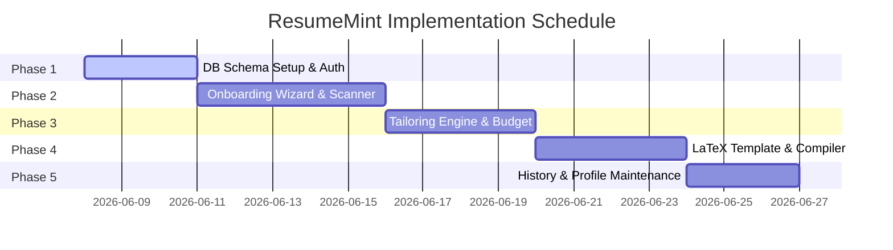

# ResumeMint Technical Implementation Plan

This implementation plan details the technical stack, codebase structure, database relationships, step-by-step developer tasks, and verification pipeline for building **ResumeMint**.

---

## 1. Technological Stack

* **Frontend**: Next.js (App Router, React 19) for fast server-side rendering, SEO compatibility, and API routes.
* **Styling**: Modern Vanilla CSS (using CSS Modules for component scoping) with a robust design token system (colors, typography, grid) to maintain high-premium visual design.
* **Database & ORM**: Supabase (PostgreSQL) managed via Prisma ORM for strong schema constraints and relational mappings.
* **Storage**: Supabase Storage for host-generated PDF files (enforcing the 5-file historical cap).
* **AI API Integration**: Google Gemini API or OpenAI API (`gpt-4o-mini`) for repository scanning, bullet summaries, certification optimization, and ATS matching reports.
* **PDF Compilation Pipeline**: Local/Serverless compiler running `pdflatex` or Typst CLI. Typst is preferred for sub-second compile speeds and JSON compatibility, but a standard LaTeX API endpoint (e.g., using `latex-cli` docker image) will compile the hardcoded `.tex` template.

---

## 2. Directory Structure Layout

The project files will follow this clean Next.js architecture:

```text
resumemint/
├── prisma/
│   ├── schema.prisma         # Relational database models
│   └── migrations/           # Database migrations history
├── public/
│   ├── assets/
│   │   └── nsut_logo.png     # Official placement logo
├── src/
│   ├── app/                  # Next.js App Router
│   │   ├── layout.js         # Core HTML layout & Font bindings
│   │   ├── page.js           # Landings/Auth Entry page
│   │   ├── dashboard/        # Main profile dashboard & resume list
│   │   ├── onboarding/       # Multi-step wizard layout & steps
│   │   ├── tailoring/        # Job description & item selector wizard
│   │   └── api/              # Serverless API Endpoints
│   │       ├── scan-repo/    # GitHub scanning handler
│   │       ├── optimize-cert/# Course / Certificate optimizer
│   │       ├── recommend/    # JD keyword matching extractor
│   │       └── compile/      # LaTeX template injection & PDF builder
│   ├── components/           # Reusable UI Components
│   │   ├── Wizard/           # Onboarding Wizard shell & navigation
│   │   ├── PDFPreview/       # Side-by-side preview panel
│   │   ├── BudgetMeter/      # One-page enforcer line counter bar
│   │   └── common/           # Tag inputs, custom fields, buttons
│   ├── lib/                  # Backend helpers & external clients
│   │   ├── prisma.js         # Singleton Prisma client
│   │   ├── ai.js             # AI prompt calls wrapper
│   │   └── compiler.js       # LaTeX/PDF compilation utility
│   └── styles/               # Design System & Base Styling
│       ├── variables.css     # HSL Colors, margins, transitions
│       ├── global.css        # Reset rules & layout containers
│       └── components/       # CSS modules for custom wizard components
```

---

## 3. Database Schema Mapping
The database models are outlined in [functional_workflow.md](file:///c:/Users/Dushy/OneDrive/Desktop/Projects/resumemint/functional_workflow.md#L44).
To enforce integrity, the `User` table holds a verified `@nsut.ac.in` email index, while `Resume` metadata logs track created files, keeping exactly 5 entries.

---

## 4. Phased Implementation Milestones



### Phase 1: Database Setup & Authenticated Verification (Days 1–3)
1. Initialize the Prisma schema and run migrations to create the Supabase Postgres tables.
2. Configure authentication middleware:
   * Allow registration with any email provider.
   * Lock all subsequent app views using a Next.js `middleware.js` matcher: redirect to `/verify-email` if `collegeEmail` is null or unverified.
   * Restrict `collegeEmail` registration via regex validation: `/^[a-zA-Z0-9._%+-]+@nsut\.ac\.in$/`.

### Phase 2: Multi-Step Onboarding Wizard & AI Reformatting Flow (Days 4–8)
1. **Contact & Social Step**: Implement dynamic inputs for custom social links (Label/URL fields) with HTML5 link validations.
2. **Education Details**: Build input blocks for School/College details and studied subjects mapping.
3. **AI-Assisted Checkpoint Services**:
   * Implement unified endpoints: `/api/scan-repo` for GitHub public repo file-parsing, `/api/reformat-experience` for Projects (Manual), Internships, and Leadership text reformatting, and `/api/optimize-cert` for Courses/Certifications.
   * Connect endpoints to the AI SDK to convert user metadata and raw text summaries into checkboxes (using prompt templates from `functional_workflow.md`).
4. **Experience separation**: Create separate form wizard step layouts for Internships, Leadership (LOR), and Courses/Certifications.
5. **Interactive Checkbox UI**: Create a reusable UI component that displays AI-generated bullet points as checkboxes, allows inline editing of individual bullets, and only sends selected items to the database.

### Phase 3: Tailoring Engine & Space Budget Calculation (Days 9–12)
1. **Recommendation Endpoint**: Write POST `/api/recommend` to extract JD keywords and return match recommendation markers.
2. **Selection Screens**: Create dashboard views showing pre-checked matching items with high-match visual badges.
3. **Line Budget calculator (One-Page Enforcer)**:
   * Write client-side helper `spaceCalculator.js` to estimate lines used based on character lengths, margins, and section spacing formulas (see [functional_workflow.md](file:///c:/Users/Dushy/OneDrive/Desktop/Projects/resumemint/functional_workflow.md#L162-L177)).
   * Bind lines budget calculation to a progress indicator in the selection menu. Alert users when selection is over budget (>56 lines).

### Phase 4: LaTeX Binding & PDF Compiler Pipeline (Days 13–16)
1. **Official Template**: Upload the college-approved single-column LaTeX style sheet template into `/src/lib/templates/resume.tex`.
2. **Special Character Escaping**: Write clean parser function to sanitize inputs, replacing characters (`%`, `&`, `#`, `$`, `_`) with LaTeX backslash escaped values (e.g. `\%`, `\&`).
3. **PDF Compiler Service**:
   * Implement `/api/compile` which fills data placeholders, runs local `pdflatex` or an external API instance, and outputs a binary PDF buffer.
4. **Side-by-Side Panel**: Build SplitPane layout for desktop views: Left pane displays PDF preview (using `react-pdf-viewer` or native `<iframe>`), Right pane displays code viewer with Copy/Download buttons.

### Phase 5: History Management & Profile Cleanup (Days 17–19)
1. **Resume History List**: Build returning users' dashboard showing saved resumes with custom names.
2. **Rolling Deletion Hook**: In `/api/compile` controller:
   * If user has 5 resumes, fetch oldest resume ID.
   * Call storage deletion API to purge oldest compiled PDF file.
   * Query database to cascade delete oldest resume version entries.
3. **Archive/Delete toggle**: Update profile editing dashboard with "Archive" and "Delete" actions on project items.

---

## 5. Verification & Testing Plan

### 5.1 Automated Test Suites
* **Auth Verification Test**: Assert API requests block/redirect if `user.collegeEmail` is null or domain does not match `@nsut.ac.in`.
* **String Sanitizer Test**: Assert LaTeX special character parser successfully escapes strings (e.g. `"React & Node"` becomes `"React \& Node"`).
* **Line Calculator Accuracy Test**: Check that `spaceCalculator.js` correctly flags a simulated 60-line data model as an overflow case.
* **History Cap Test**: Verify that saving a 6th resume correctly triggers deletion of the 1st resume version in the mock database database environment.

### 5.2 Manual Verification
* Deploy a test project instance.
* Scan a mock public GitHub repository and confirm progressive status loading statements appear correctly.
* Export a customized resume, copy the compiled LaTeX code, and verify it successfully compiles cleanly on Overleaf without formatting syntax errors.


