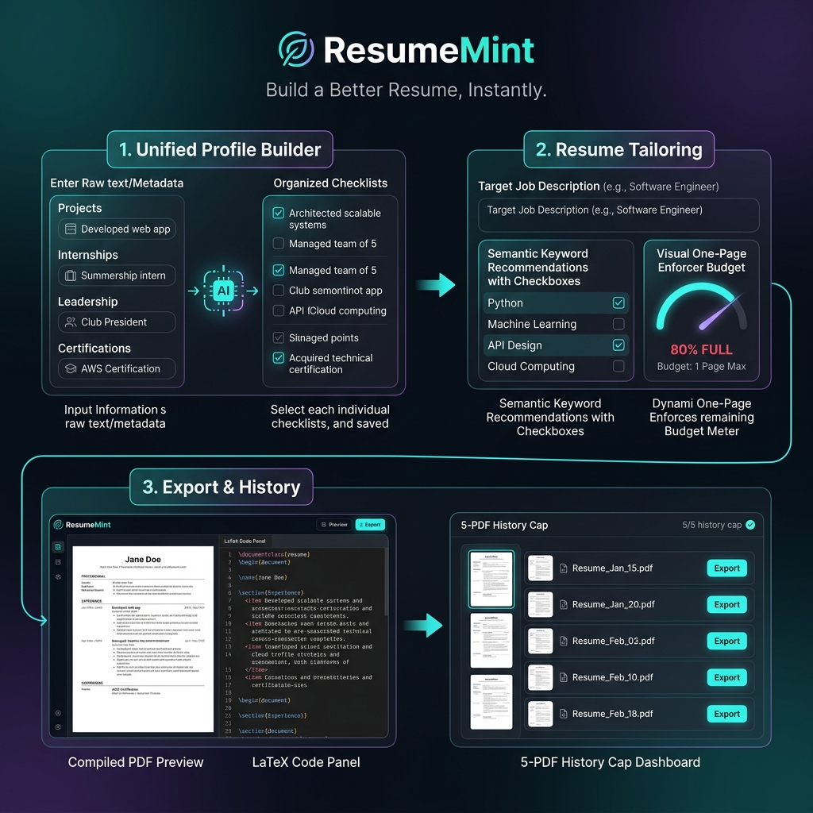

# ResumeMint Walkthrough & Capabilities Overview

We have updated the system specifications and visual models to reflect the unified AI reformatting behavior for all profile building sections.

---

## 1. Corrected System Behavior & Profile Journey

### Unified AI-Assisted Checklist Flow
* **No Direct Bullet Writing**: Students are never required to draft bullet points manually. 
* **Input Stage**: For any section added (Projects, Internships/Work Experience, Positions of Responsibility/Leadership, and Certifications/Courses), the user only inputs basic metadata and a raw text description of what they did, built, or learned.
* **Processing Stage**: The backend passes this raw text to the AI.
* **Review & Select Stage**: The AI reformats the description into professional, ATS-optimized bullet points (15-20 for projects, 10-15 for experience/leadership, 5-10 for courses). The UI displays these points as a checkbox checklist where the student can:
  * Check boxes next to the points they want to add.
  * Double-click any bullet to edit the text inline.
* **Saving Stage**: Only the checked and edited bullets are stored as active resume content in the profile database.

---

## 2. Updated Visual Capabilities Infographic

Below is the updated visual map of the user capabilities and flow, reflecting the unified AI profile builder and the AI Course & Certification Enhancer:

