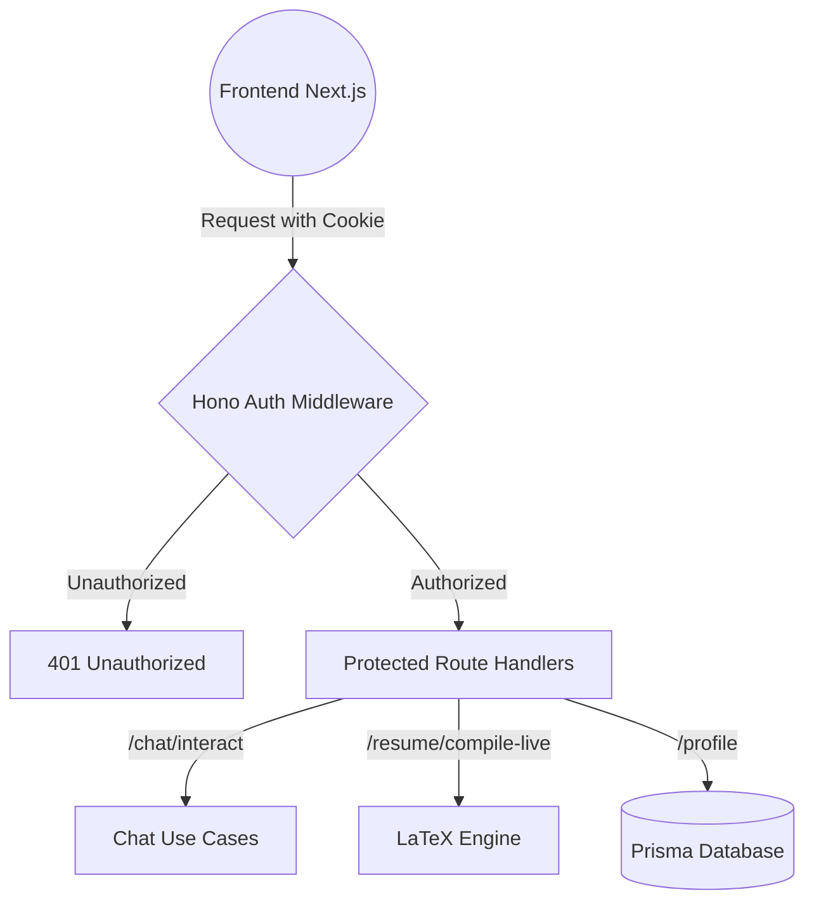
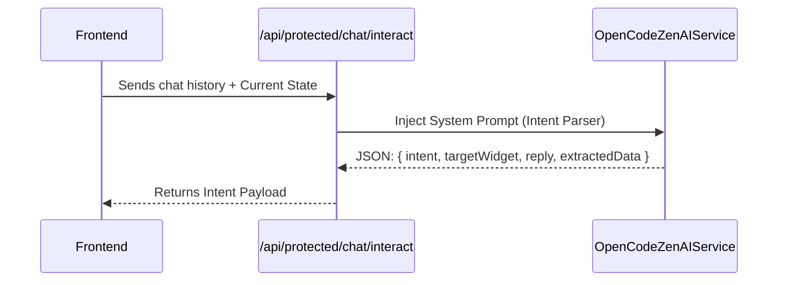
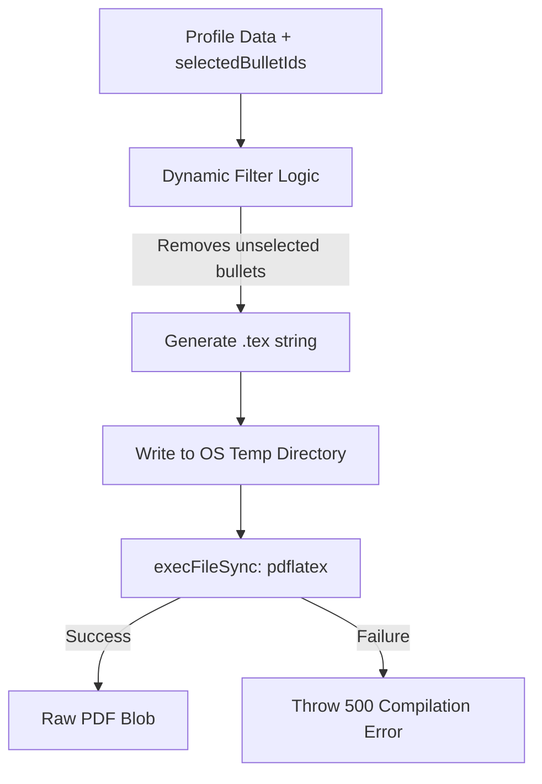

# Backend Architecture: The Core Engine

This document outlines the architectural foundation of the Resumint backend, focusing on the Express (Hono) setup, the Prisma schema mappings, and the Phase 6 AI orchestration layers for the Career Vault.

## 1. Server Framework & Routing
- **Framework:** Express with Hono for lightweight, fast routing. The entire backend runs on Render, independent of the Vercel frontend.
- **Routing Namespace:** All authenticated routes exist under the `/api/protected/*` prefix. 
- **Middleware:** The Hono middleware automatically checks the `better-auth` session cookie for any requests hitting `/api/protected/*`. Unauthenticated requests are rejected before reaching the business logic.

### API Architecture Flow

## 2. Database & ORM (Prisma)
- **Database:** PostgreSQL.
- **ORM:** Prisma v7 (`@prisma/adapter-pg`).
- **Schema Mapping:** 
  - To prevent continuous database migrations as the Vault schema evolved, fields like `experience`, `projects`, and `skills` are stored as `Json?` types in the `Profile` model.
  - The strict enforcement of types (like the `VaultBullet` structure mapping 10-12 bullets to a project) is handled at the TypeScript domain layer (`backend/src/core/domain/entities.ts`), not the database schema layer.

## 3. The AI Service Layer (`OpenCodeZenAIService`)
The backend relies on the `OpenCodeZenAIService` which directly fetches from `https://opencode.ai/zen/v1/chat/completions` using the `deepseek-v4-flash-free` model. 

### AI Interaction Diagram

### A. Intent Parsing (`POST /api/protected/chat/interact`)
-   **Role:** The brain of the chat interface.
-   **Function:** It receives the chat history and current user state. It uses a strict system prompt to determine the user's intent (`PROVIDE_DATA` vs `NAVIGATE`), decides which widget to display, and extracts any relevant profile data from the conversation.

### B. Vault Expansion (`POST /api/protected/ai/expand-vault`)
-   **Role:** Replaces the old bullet generation endpoint.
-   **Function:** When a user describes a project or experience, this endpoint commands the AI to generate an exhaustive list of 10-12 `VaultBullet` items. These cover different aspects (Frontend, Backend, DevOps, Leadership) ensuring the Vault is fully armed for any Job Description.

### C. Bullet Selection (`POST /api/protected/ai/select-bullets`)
-   **Role:** The engine for the Left Panel checklist in the Builder.
-   **Function:** Accepts a Job Description (JD) and the user's exhaustive Vault. It performs semantic matching and returns only the IDs of the 3-4 bullets per project that best align with the JD requirements.

## 4. LaTeX Compilation Pipeline
PDF generation relies on server-side LaTeX compilation rather than brittle HTML-to-PDF solutions.

### LaTeX Generation Flow

### `POST /api/protected/resume/compile-live`
-   **Input:** Receives the user's `profile` and the `selectedBulletIds` mapping.
-   **Dynamic Filtering:** The LaTeX template generator iterates through the user's experiences and projects. It **only** renders a bullet point if its `id` exists in the `selectedBulletIds` array provided by the frontend.
-   **Compilation:** It generates a `.tex` file in a temporary directory and executes `pdflatex` via `execFileSync` to produce the PDF.
-   **Output:** Returns the raw PDF binary (blob) to the frontend.

## 5. Security & Edge Cases
-   **Shell Injection Prevention:** The `compile-live` endpoint uses strict whitelist validation for template IDs and `execFileSync` (avoiding shell interpolation) to prevent RCE vulnerabilities.
-   **JSON Extraction:** The AI service uses robust brace-counting extraction to reliably pull JSON payloads from AI responses, even if the model hallucinates surrounding prose.
