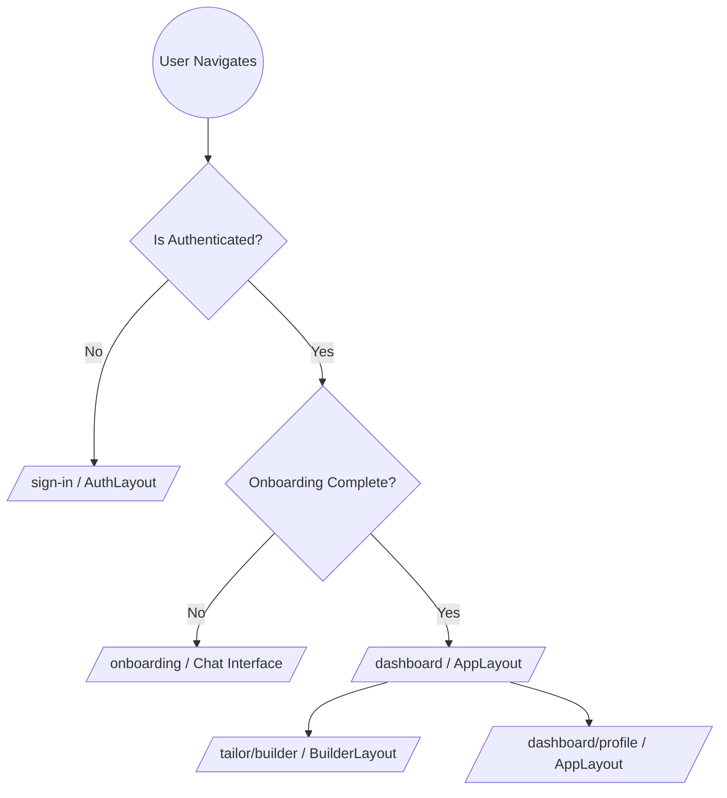
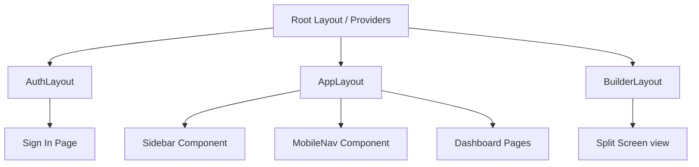
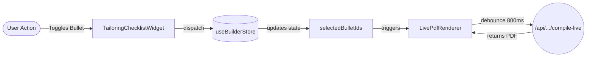
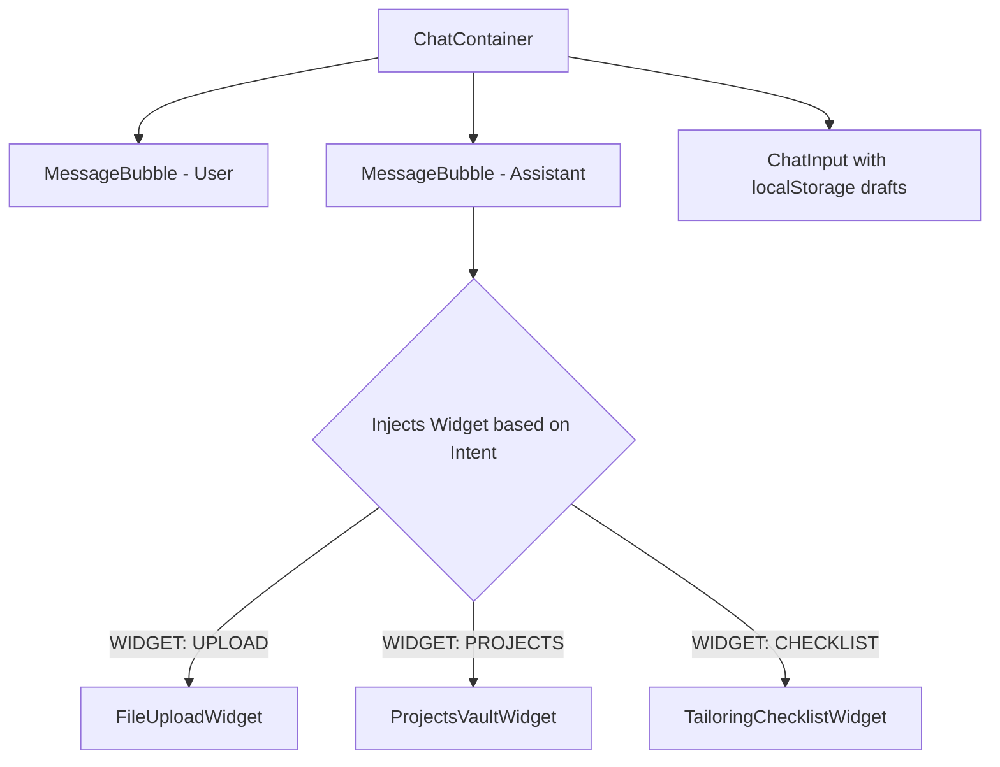

# Frontend Architecture: The Career Vault & Builder

This document outlines the architectural foundation of the Resumint frontend, focusing on the Phase 6 transition to a Chat-Driven Career Vault and the Split-Screen Resume Builder.

## 1. Core Framework & Routing
- **Framework:** Next.js 16 (App Router), leveraging Turbopack for fast compilation.
- **Styling:** Tailwind CSS v4 using a centralized design system defined in `globals.css` (Glassmorphism, custom typography).
- **Icons:** `@phosphor-icons/react` for crisp, consistent UI icons.

### Routing Flow

## 2. Layout Hierarchy
The application uses distinct layouts depending on the user's context.

## 3. State Management (Zustand)
The complexity of live PDF rendering and contextual chat requires robust global state management, handled via Zustand slices rather than heavy React Context providers.

### State Flow Diagram

### `useChatStore`
Manages the state of the conversational UI.
-   **State**: Array of chat messages, current onboarding phase, extracted profile data.
-   **Actions**: `sendMessage` (sends payload to backend and appends response), `clearChat` (resets context).

### `useBuilderStore`
The core engine for the split-screen tailoring experience.
-   **State**: `profile` data, `jobDescription`, and crucially, `selectedBulletIds` (a `Record<string, string[]>` mapping a project/experience ID to an array of selected Vault Bullet IDs).
-   **Actions**: `toggleBullet` (updates the array of selected bullets for an item), `triggerCompile` (debounced call to the backend PDF compiler).

## 4. Key Component Architecture

### The Chat Interface Hierarchy

-   **`ChatContainer`**: The scrollable container that renders messages. It automatically scrolls to the bottom on new messages.
-   **`MessageBubble`**: Renders the text of the AI/User. Crucially, it parses the `widget` property from the backend response and injects dynamic React components inline.

### The Live Builder (`LivePdfRenderer`)
-   Located on the right side of the split-screen (`65%` width).
-   It listens to changes in `useBuilderStore.selectedBulletIds`.
-   **Debounce Logic**: To prevent spamming the backend LaTeX compiler, it debounces changes by `800ms`. When compiling, it shows a shimmering skeleton overlay. Upon success, it updates the `iframe` with the returned PDF blob URL.

## 5. Network & API Layer
-   **`fetchWithSession`**: A unified utility in `src/lib/fetch.ts` that automatically attaches the user's session cookie and forwards requests to the Render backend (`INTERNAL_API_URL` for SSR, `NEXT_PUBLIC_API_URL` for client).
-   It handles `Content-Type: application/json` automatically, unless a `FormData` object (like a PDF upload) is passed.

## 6. Authentication (Better Auth)
-   Authentication is handled by Better Auth using the Google OAuth2 plugin.
-   Client-side authentication state is fetched via `createAuthClient()`.
-   The "Sign In" button is abstracted into a reusable `SignInButton` component with variants (`default`, `minimal`).
