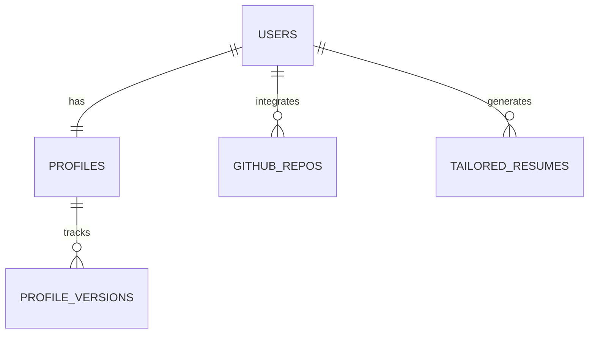

# User Data Lifecycle & Storage Specification

This document details the end-to-end data lifecycle of Resumint. It outlines how user data is ingested from existing resumes, enriched via integrations and manual inputs, parsed and structured by AI, stored securely, and retrieved to generate tailored resumes.

---

## 1. High-Level Data Flow Architecture

The diagram below represents the complete flow of data from ingestion (cold start) to persistent storage and ultimate utilization during tailoring.

```mermaid
graph TD
    %% Ingestion Sources
    A1[Old PDF Resume] -->|1. Raw Text Extraction| B[PDF Parser Service]
    A2[GitHub API Integration] -->|3. Sync Repositories| D[Dashboard Service]
    A3[Manual User Input] -->|4. Profile Enrichment| D

    %% AI & Structuring
    B -->|2. Raw Text Content| C[AI Extraction Engine (LLM)]
    C -->|Structured JSON| D

    %% Storage
    D -->|5. Read/Write Profile Data| E[(Database)]

    %% Tailoring Process
    E -->|6. Retrieve Up-to-Date Profile| F[AI Tailoring Engine]
    G[Job Description (JD)] -->|7. Ingest JD| F
    F -->|8. Structured Custom Resume| H[PDF Render Engine]
    F -->|9. Save History Copy| E
    H -->|10. Downloadable PDF| I((User Download))
```

---

## 2. In-Depth Data Lifecycle Stages

### Stage 1: Cold Start Ingestion (First-Time User)
1. **Raw Text Extraction**:
   - The system reads raw bytes from the uploaded PDF resume.
   - Clean UTF-8 text is extracted, stripping layout headers and lines, preserving space/newlines.
2. **AI-Driven Structuring (LLM Parsing)**:
   - The raw text is wrapped in a structured prompt and sent to the LLM (OpenCode Zen / `deepseek-v4-flash-free` via direct `fetch`).
   - **System Instruction**: Enforces parsing the text into a strict JSON format (with explicit schema in the prompt).
   - **Data Validation**: The server parses the response via `extractJson()` regex, then validates with Zod to ensure essential keys (e.g., `education`, `skills`) are present and correctly typed.
3. **User Approval (Form Review)**:
   - The UI renders the parsed JSON structure in editable form fields.
   - The user corrects any parsing errors (e.g., incorrectly structured dates or organization names) and clicks "Save Profile".

### Stage 2: Profile Enrichment (Continuous Data Accumulation)
1. **GitHub Syncing**:
   - When the user connects GitHub, the system retrieves list of public repositories.
   - **AI Analysis of Projects**: For selected repos, the system reads the `README.md` and repository description, using AI to summarize the repository's core accomplishments into 2-3 impact-driven resume bullet points (using the STAR method: Situation, Task, Action, Result).
2. **Manual Additions**:
   - The user can add certifications, links, competitive programming handles (e.g., LeetCode/CodeForces), and extra coursework directly.

### Stage 3: Resume Tailoring & Versioning (Retrieval & Transformation)
1. **Context Compiling**:
   - The system retrieves the user's complete profile from the database.
   - It ingests the target Job Description (JD).
2. **AI Tailoring (LLM Processing)**:
   - The LLM receives the profile data and the JD.
   - It rewrites existing bullet points to align with keywords and competencies in the JD while maintaining absolute factual accuracy.
3. **Immutable History Generation**:
   - The generated tailored resume data is stored in the `TailoredResumes` table as a snapshot.
   - **Crucial Rule**: The snapshot is stored as JSON content. Even if the user edits their profile later, the historical tailored resume remains unchanged.

---

## 3. Database Schema Design (JSON & Relational Map)

Below is the structured data schema mapped for a relational database (PostgreSQL with `JSONB` for flexible attributes) or document store.

### A. Database Relationships



### B. Detailed Tables Schema

#### 1. `users` Table
Stores authentication and account identifier details.
| Column | Type | Description |
| :--- | :--- | :--- |
| `id` (PK) | UUID | Unique user identifier |
| `email` | VARCHAR | Institutional email address (e.g. `example@nsut.ac.in`) |
| `name` | VARCHAR | Full name retrieved from Google OAuth |
| `avatar_url` | VARCHAR | Link to Google profile picture |
| `created_at` | TIMESTAMP | Creation timestamp |

#### 2. `profiles` Table
Stores the user's active master profile. This represents the cumulative "truth" about a user's skills and experiences.
| Column | Type | Description |
| :--- | :--- | :--- |
| `id` (PK) | UUID | Unique profile identifier |
| `user_id` (FK) | UUID | Reference to `users.id` (1-to-1) |
| `contact` | JSONB | `{ "phone": "+91...", "linkedin": "...", "github": "...", "portfolio": "..." }` |
| `education` | JSONB | List of objects: `[{ "school", "degree", "gpa", "start_year", "end_year" }]` |
| `experience` | JSONB | List of objects: `[{ "company", "role", "bullets": [...], "start", "end" }]` |
| `projects` | JSONB | List of objects: `[{ "title", "tech_stack": [], "bullets": [], "url" }]` |
| `skills` | JSONB | Organized by category: `{ "languages": [], "frameworks": [], "tools": [] }` |
| `updated_at` | TIMESTAMP | Last updated time |

#### 3. `github_repos` Table
Caches user's selected/synced GitHub repositories for quick dashboard access and reloading.
| Column | Type | Description |
| :--- | :--- | :--- |
| `id` (PK) | UUID | Unique ID |
| `user_id` (FK) | UUID | Reference to `users.id` |
| `repo_name` | VARCHAR | Name of the repository |
| `repo_url` | VARCHAR | GitHub repository link |
| `tech_stack` | JSONB | Primary languages detected |
| `bullets_generated`| JSONB | AI-summarized accomplishment bullet points |
| `synced_at` | TIMESTAMP | Sync timestamp |

#### 4. `tailored_resumes` Table (History)
Stores immutable snapshots of tailored resumes generated for specific roles.
| Column | Type | Description |
| :--- | :--- | :--- |
| `id` (PK) | UUID | Unique resume version ID |
| `user_id` (FK) | UUID | Reference to `users.id` |
| `company_name` | VARCHAR | Target company (e.g., "Google") |
| `job_title` | VARCHAR | Target job title (e.g., "Frontend Intern") |
| `job_description` | TEXT | Raw Job Description text pasted by the user |
| `tailored_profile_data`| JSONB | Snapshot of tailored profile (skills, tailored experience bullets, projects) |
| `style_config` | JSONB | Accent color, font family, padding, and layout selection |
| `created_at` | TIMESTAMP | Time of generation |

---

## 4. AI Ingestion & Analysis Prompt Specs

To ensure clean processing during stage 1 (PDF Parse) and stage 2 (GitHub Sync), the backend calls the LLM with strict input schemas.

### PDF Extraction Prompt Structure
```json
{
  "role": "system",
  "content": "You are a precise resume data extractor. Extract the following fields from the resume text and return ONLY valid JSON matching the schema. If a field is missing from the resume, use null for scalar fields and empty arrays for list fields. Return ONLY the raw JSON object — no markdown, no code fences, no explanation, no surrounding text.\n\nExpected JSON structure:\n{\n  \"contact\": { \"phone\": string | null, \"linkedin\": string | null, \"github\": string | null, \"portfolio\": string | null },\n  \"education\": [{ \"school\": string, \"degree\": string, \"gpa\": string | null, \"startYear\": number | null, \"endYear\": number | null }],\n  \"experience\": [{ \"company\": string, \"role\": string, \"startDate\": string | null, \"endDate\": string | null, \"bullets\": string[] }],\n  \"projects\": [{ \"title\": string, \"techStack\": string[], \"bullets\": string[], \"url\": string | null }],\n  \"skills\": { \"languages\": string[], \"frameworks\": string[], \"tools\": string[] }\n}"
}
```

### GitHub Projects Synthesis Prompt Structure
```json
{
  "role": "system",
  "content": "You are an expert technical resume writer. Analyze the following GitHub repository metadata and README file contents. Draft 3 impact-driven resume bullet points describing the project using the STAR (Situation, Task, Action, Result) methodology. Avoid buzzwords. Highlight technologies used: React, Docker, etc."
}
```
